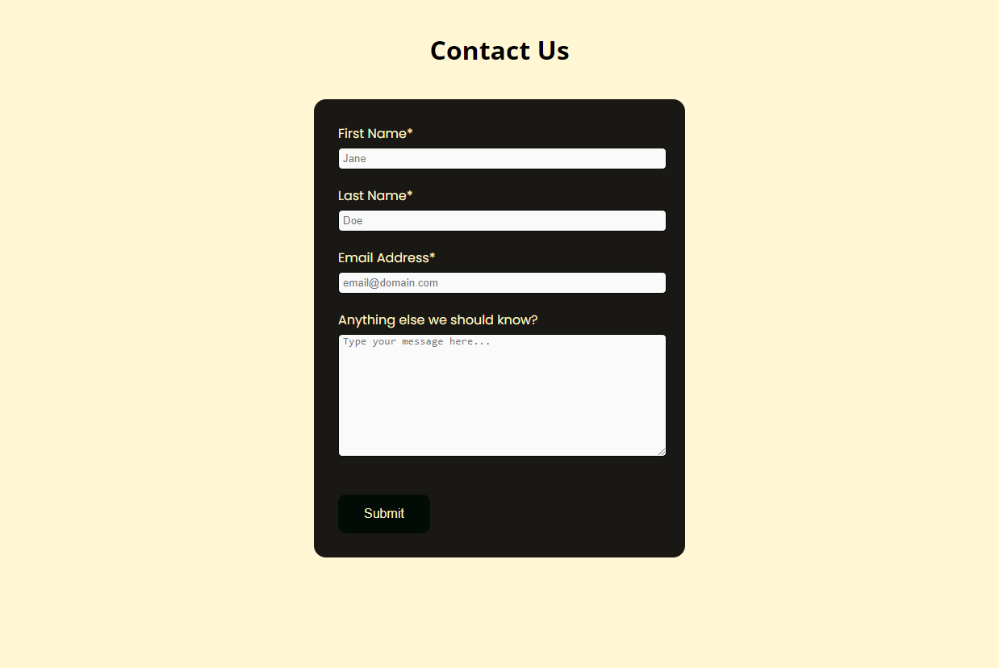

# Modern Annex

Modern Annex is a site that hopes to promote a business that provides custom designs and plans for annex builds. The site will be targeted towards people who are planning to build an annex and want a custom design and building plans that they can provide to a contractor. Modern Annex will be useful for people to learn what the business does, to see previous designs and builds, and to make a business enquiry of their own.

---------------
## User Stories

- As a visiting user, I want to easily navigate between pages on the website.
- As a visiting user, I want to know what the business is about.
- As a visiting user, I want to view the previous work of the owner.
- As a visiting user, I want to contact the owner for business enquiries.
- As a visiting user, I want to receive feedback when I successfully submit the contact form.

---------------
## Features 

In this section, you should go over the different parts of your project, and describe each in a sentence or so. You will need to explain what value each of the features provides for the user, focusing on who this website is for, what it is that they want to achieve and how your project is the best way to help them achieve these things.

### Existing Features

#### Header
- Featured on all three pages, the fully responsive header includes the company logo which links to the home page when clicked, and a navigation menu with links to the Home page, Gallery and Contact page, and is identical on each page to allow for easy navigation.
- The header will allow the user to easily navigate from page to page across all devices without having to revert back to the previous page via the browser's ‘back’ button.
- The header also remains fixed to the top of the page as the user scrolls, to allow for easy navigation between pages without making the user have to scroll back up to find the navigation links.

#### Navigation Bar
- The link for the active page will display with an underline, as a visual cue to show the user which page they are currently on.
- As the user hovers over each link in the menu, a text underline will appear to provide the user feedback as to which link they are about to click on.

#### The Hero Section
- The Hero section includes a background image with text overlay to allow the user to see at a glance what the business is about. 
- This section introduces the user to Modern Annex with an eye-catching image and title to grab their attention.

#### About Section
  - The About section will allow the user to read about who the business is and what they do. 
  - The user will see images that illustrate the business concept. This should encourage the user to get in touch for a business enquiry. 

#### The Footer
  - The footer section is very simple. It is a strip with the same background color and font color as the header, and contains a copyright disclaimer. 
  - The footer is still valuable to the user as it lets them know they have reached the bottom of the page, and acts as a counterbalance to the header.

#### Gallery

  - The gallery is fully responsive and will provide the user with images to see more of the previous projects that the business has done. 
  - This section is valuable to the user as they will be able to easily identify the type of buildings that the business owner has designed in the past. 

#### The Contact Page

  - This page will allow the user to contact the website owner with a business enquiry or any questions they may have. The user will be able to freely write their message in a text area. The user will be required to submit their first name, last name, and email address.

#### The Form Feedback Page

- This page appears after a user correctly fills out the contact form and clicks the submit button.
- The header and navigation menu remains at the top of the page for easy navigation, and a link is provided to take the user back to the previous page.
- This page provides value to the user as feedback to let them know the form was successfully submitted, and allows them to easily navigate back to the other pages.

### Features Left to Implement

- Image gallery carousel, or the ability to enlarge images by clicking on them.
- Call To Action buttons
- Frequently Asked Questions
- Social media links in the footer
- Background image on the contact page and/or a nicer background color
- Responsiveness for mobile screens as small as Galaxy Fold
- More detailed information in the About Section about how the business works
- More input fields in the contact form to get more specific information from the customer

----

## Testing 

In this section, you need to convince the assessor that you have conducted enough testing to legitimately believe that the site works well. Essentially, in this part you will want to go over all of your project’s features and ensure that they all work as intended, with the project providing an easy and straightforward way for the users to achieve their goals.

In addition, you should mention in this section how your project looks and works on different browsers and screen sizes.

You should also mention in this section any interesting bugs or problems you discovered during your testing, even if you haven't addressed them yet.

If this section grows too long, you may want to split it off into a separate file and link to it from here.

### Responsiveness
- All pages have been throughly tested for screen sizes from 320px wide and up, using the device tool bar and responsiveness testing tools in Google Chrome DevTools.
- The site is responsive on all screen sizes and no images are pixelated or stretched. There is no unwanted horizontal scroll, and no elements overlap.
- All links on the website, including the navigation links and the logo, have been tested to make sure they take the user to the right page when clicked.

### Validator Testing 

- **HTML**: No errors or warnings were shown when checking code with the official [W3C HTML validator](https://validator.w3.org/)
- **CSS**: No errors were found when checking code with the official [W3C (Jigsaw) CSS validator](https://jigsaw.w3.org/css-validator/)

### Accessibility

- All pages have been tested with Lighthouse and have a high accessibility score.
- All pages have been tested with Wave accessibility evaluation tool with no errors.

### Unfixed Bugs

You will need to mention unfixed bugs and why they were not fixed. This section should include shortcomings of the frameworks or technologies used. Although time can be a big variable to consider, paucity of time and difficulty understanding implementation is not a valid reason to leave bugs unfixed.

- Proper responsiveness has not been implemented for screen sizes narrower than 320px, for example the Galaxy Fold. For screen sizes this small, the links in the navigation menu don't fit on one line, and some elements overlap.
  - The reason for not fixing this is a lack of time, and because I wanted to prioritise making sure the site is responsive for the most common mobile sizes.

## Deployment 

The live site can be viewed here: https://lmflolo.github.io/pp1/

- The site was deployed using GitHub Pages. The steps to deploy are as follows: 
  1. From the GitHub repository, navigate to the Settings tab at the far right of the top menu
  2. Then navigate to the Pages tab in the left-side menu
  3. From the Source section drop-down menu, make sure 'Deploy from a branch' is selected
  4. Select 'main' and '/ (root)' from the Branch drop-down menus, then click Save
  5. After giving the site a few minutes to build, refresh the page and the link for the live site will appear at the top of the GitHub Pages tab

## Credits 

In this section you need to reference where you got your content, media and extra help from. It is common practice to use code from other repositories and tutorials, however, it is important to be very specific about these sources to avoid plagiarism. 

You can break the credits section up into Content and Media, depending on what you have included in your project. 

### Content 

- The text for the Home page was taken from Wikipedia Article A
- Instructions on how to implement form validation on the Sign Up page was taken from [Specific YouTube Tutorial](https://www.youtube.com/)
- The icons in the footer were taken from [Font Awesome](https://fontawesome.com/)

### Media

- The photos used on the home and sign up page are from This Open Source site
- The images used for the gallery page were taken from this other open source site