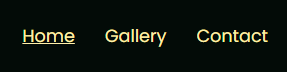
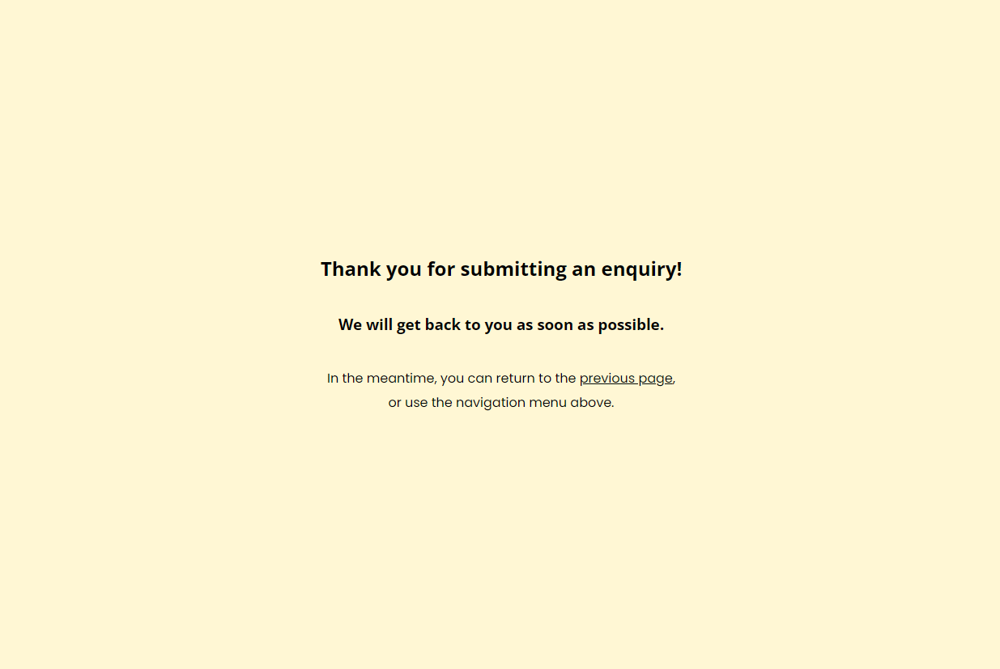
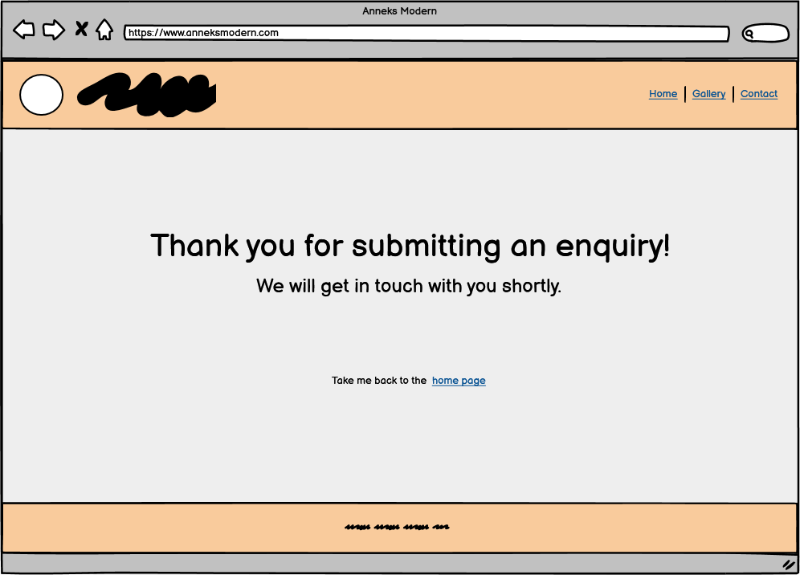
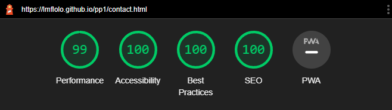

# Modern Annex

Modern Annex is a site that hopes to promote a business that provides custom designs and plans for annex builds. The site will be targeted towards people who are planning to build an annex and want a custom design and building plans that they can provide to a contractor. Modern Annex will be useful for people to learn what the business does, to see previous designs and builds, and to make a business enquiry of their own.

You can find the deployed site [HERE](https://lmflolo.github.io/pp1/).

---------------
## User Stories

- As a visiting user, I want to easily navigate between pages on the website.
- As a visiting user, I want to know what the business is about.
- As a visiting user, I want to view the previous work of the owner.
- As a visiting user, I want to contact the owner for business enquiries.
- As a visiting user, I want to receive feedback when I successfully submit the contact form.

---------------
## Features

### Existing Features

#### Header
- Featured on all three pages, the fully responsive header includes the company name which links to the home page when clicked, and a navigation menu with links to the Home page, Gallery and Contact page, and is identical on each page to allow for easy navigation.
- The header will allow the user to easily navigate from page to page across all devices without having to revert back to the previous page via the browser's ‘back’ button.
- The header also remains fixed to the top of the page as the user scrolls, to allow for easy navigation between pages without making the user have to scroll back up to find the navigation links.

#### Navigation Bar
- The link for the active page will display with an underline, as a visual cue to show the user which page they are currently on.
- As the user hovers over each link in the menu, a text underline will appear to provide the user feedback as to which link they are about to click on.

#### The Hero Section
- The Hero section includes a background image with text overlay to allow the user to see at a glance what the business is about. 
- This section introduces the user to Modern Annex with an eye-catching image and title to grab their attention.

#### About Section
  - The About section will allow the user to read about who the business is and what they do. 
  - The user will see images that illustrate the business concept. This should encourage the user to get in touch for a business enquiry. 

#### The Footer
  - The footer section is very simple. It is a strip with the same background color and font color as the header, and contains a copyright disclaimer. 
  - The footer is still valuable to the user as it lets them know they have reached the bottom of the page, and acts as a counterbalance to the header.

#### Gallery

  - The gallery is fully responsive and will provide the user with images to see more of the previous projects that the business has done. 
  - This section is valuable to the user as they will be able to easily identify the type of buildings that the business owner has designed in the past. 

#### The Contact Page

  - This page will allow the user to contact the website owner with a business enquiry or any questions they may have. The user will be able to freely write their message in a text area. The user will be required to submit their first name, last name, and email address.
  - An asterisk indicates to the user which input fields are required.

#### The Form Feedback Page

- This page appears after a user correctly fills out the contact form and clicks the submit button.
- The header and navigation menu remains at the top of the page for easy navigation, and a link is provided to take the user back to the previous page.
- This page provides value to the user as feedback to let them know the form was successfully submitted, and allows them to easily navigate back to the other pages.

### Features Left to Implement

- Image gallery carousel, or the ability to enlarge images by clicking on them
- Call To Action buttons
- Frequently Asked Questions
- Social media links in the footer
- Background image on the contact page and/or a nicer background color
- Responsiveness for mobile screens as small as Galaxy Fold
- More detailed information in the About Section about how the business works
- More input fields in the contact form to get more specific information from the customer

## Wireframes ##
----

  
Desktop wirefames

  
Index Page:

    
  
Gallery Page:

    
  
Contact Page:

    
  
Form Feedback Page:

    

  
Mobile wirefames

  
Index Page:

    
  
Gallery Page:

    
  
Contact Page:

    
  
Form Feedback Page:

    

## Testing
----
- The site has been tested and confirmed to work with Chrome, Edge and Firefox on desktop, and Chrome on an Android phone.
- All links on the website, including the navigation links and the logo, have been tested to make sure they take the user to the right page when clicked.
- I have tested that the contact form works as intended; all fields with an asterisk need to be filled in, the email input only accepts an email, and the submit button works.

### Responsiveness

- All pages have been thoroughly tested for screen sizes from 320px wide and up, using the device toolbar in Google Chrome DevTools.
- The site is fully responsive on all tested screen sizes and no images are overly pixelated or stretched. There is no unwanted horizontal scroll, and no elements overlap.

### Code Validation

- **HTML**: No errors or warnings were shown when checking code with the official [W3C HTML validator](https://validator.w3.org/)
- **CSS**: No errors were found when checking code with the official [W3C (Jigsaw) CSS validator](https://jigsaw.w3.org/css-validator/)

### Accessibility

- All pages have been tested with Lighthouse in Chrome DevTools and have a high accessibility score.
- The poor SEO score on the form feedback page is because the "here" link does not have descriptive text.

  
Lighthouse Screenshots

  
Index Page:

    
  
Gallery Page:

    
  
Contact Page:

    
  
Form Feedback Page:

    

- All pages have been tested with [Wave](https://wave.webaim.org/) accessibility evaluation tool with no errors.
- The alerts point out that two adjacent links go to the same URL (i.e. the logo and Home button in the navbar), some images have long alternative text, and the "here" link on the form feedback page is too non-descript.

  
Wave Screenshots

  
Index Page:

    
  
Gallery Page:

    
  
Contact Page:

    
  
Form Feedback Page:

    

### Unfixed Bugs

- Proper responsiveness has not been implemented for screen sizes narrower than 320px, for example the Galaxy Fold. For screen sizes this small, the links in the navigation menu don't fit on one line, and some elements overlap.
  - The reason for not fixing this is a lack of time, and because I wanted to prioritise making sure the site is responsive for the most common screen sizes.

----

## Deployment

The live site can be viewed here: https://lmflolo.github.io/pp1/

### Gitpod

The site was developed using the Gitpod IDE. All code and files were saved and submitted to the GitHub repo with git version control by using the Git commands 'git add', 'git commit' and 'git push'.

### GitHub Pages

The site was deployed using GitHub Pages. The steps to deploy are as follows: 
1. From the GitHub repository, navigate to the Settings tab at the far right of the top menu
2. Then navigate to the Pages tab in the left-side menu
3. From the Source section drop-down menu, make sure 'Deploy from a branch' is selected
4. Select 'main' and '/ (root)' from the Branch drop-down menus, then click Save
5. After giving the site a few minutes to build, refresh the page and the link for the live site will appear at the top of the GitHub Pages tab

----

## Credits 

### Content 

- This README document is based on the Code Institute [README template](https://github.com/Code-Institute-Solutions/readme-template).

- [Love Running](https://github.com/lmflolo/love-running):
  - Inspiration for layout and design, reference on how to approach this project.
  - Used and adapted HTML and CSS code for the header (logo and navigation menu), hero section and contact form.
  - Reference for media queries.
  - Used code for removing default margin, padding and border on all HTML elements.

- Instructions on how to make the fixed header were found on [W3Schools](https://www.w3schools.com/howto/howto_css_fixed_menu.asp)
- The favicons were obtained from [favicon.io](https://favicon.io/)

- I learned how to implement the form feedback page by reading previous posts from David Bowers in the Code Institute Slack community, and by looking at his [Portfolio Project 1 site](https://pp1.dev-bowers.com/contact.html).

- I have used the following Code Institute student project sites, as well as their GitHub repos, as inspiration to see what a high quality project looks like. This includes getting inspiration for layout and design, fonts, how to implement code, how to comment the code, what to write in the readme, etc.
  - Batala Bangor: [live site](https://emmahewson.github.io/mp1_batala_bangor/), [repo](https://github.com/emmahewson/mp1_batala_bangor)
  - MadMiners SMP: [live site](https://madmaddie81.github.io/mad-miners-smp/index.html), [repo](https://github.com/MadMaddie81/mad-miners-smp)

### Media

- All images used on this website were downloaded from [Unsplash](https://unsplash.com/)